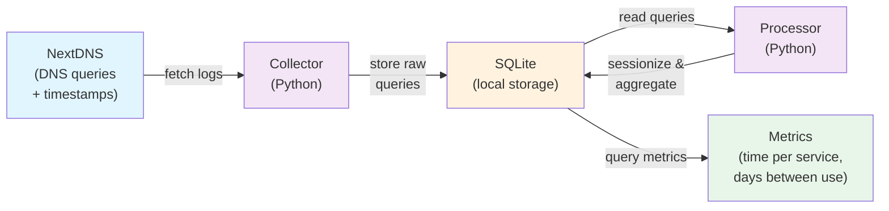
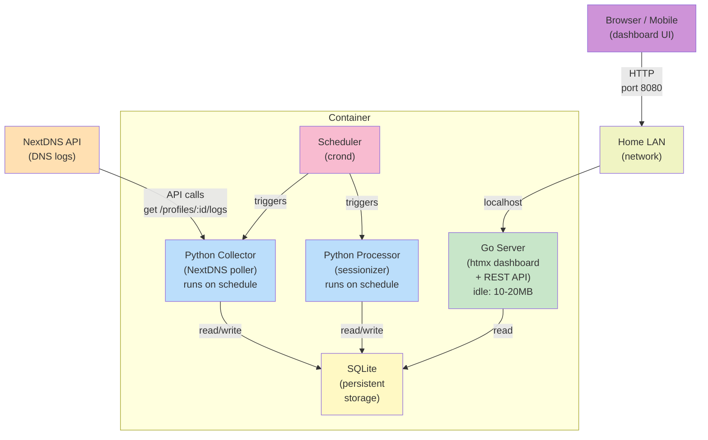
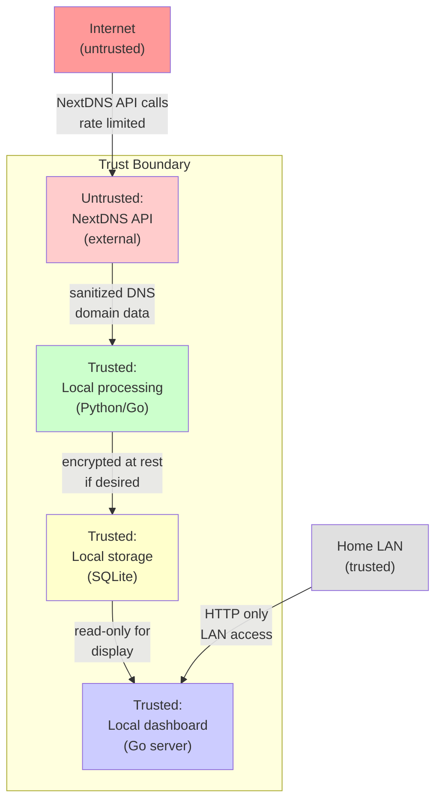

# Sverdrup Architecture

## Overview

Sverdrup is a containerized streaming-service usage measurement system. It collects DNS query logs from NextDNS, processes them into viewing sessions, stores them in SQLite, and serves analytics and insights via a lightweight web dashboard.

The system is designed for home deployment: minimal idle footprint (~10-20MB), mobile-friendly interface, and no external dependencies beyond NextDNS. It can eventually evolve to act as a local DNS server or support additional data sources.

## Design Principles

- **Low idle footprint:** Long-running server is Go (minimal memory); batch jobs are Python (cost only when running)
- **Self-contained:** Single container with all components; SQLite holds all data
- **Privacy-first:** Data never leaves your network; all processing is local
- **LAN-only by default:** Dashboard accessible only on local network, with option for reverse-proxy deployment
- **Incremental:** Backfills NextDNS history on first run, then polls incrementally; local storage becomes the long-term archive

## System Architecture

The system has three main layers: collection, processing, and presentation.

### Data Layer

The data flow from NextDNS through to metrics:



**Data model:**
- **Queries table:** timestamp, device_name, domain_queried, raw_entry (for full NextDNS event)
- **Sessions table:** service_id, start_time, end_time, device_name (sessionized queries grouped by service and gaps)
- **Services table:** service_code (netflix, spotify, etc.), service_name, domains (list of DNS domains to match)
- **Metrics table:** service_id, date, total_minutes, session_count, last_seen_date (precomputed daily and lifetime stats)

### Infrastructure Layer

Deployment and runtime architecture:



**Key properties:**
- **Single container image:** Go binary, Python scripts, SQLite database
- **Scheduler:** crond manages collector and processor execution on a fixed interval (e.g., every 15 minutes for collector, hourly for processor)
- **Go server:** Always-on, stateless, reads from SQLite
- **Separation of concerns:** Collector handles API polling; processor handles data transformation; server handles query and presentation
- **Entrypoint script:** Container startup runs both crond (background) and Go server (foreground) so scheduled jobs execute within the container

### Security and Trust Layer



**Security properties:**
- **External input validation:** NextDNS API responses are validated before storage
- **No credentials in container:** NextDNS API key and URL are environment variables, passed at runtime
- **Local-only by default:** Dashboard listens on localhost; accessible only on home LAN
- **Reverse-proxy ready:** Can be placed behind a reverse proxy for broader access (authentication is the proxy's responsibility)
- **No external data export:** All data remains on local storage; no phoning home

## Components

### 1. Collector (Python)

**Responsibility:** Fetch DNS logs from NextDNS API, backfill history on first run, poll incrementally.

**Runtime:** Scheduled job (Python script invoked every 15 minutes by crond)

**Inputs:**
- NextDNS API endpoint (env var: `NEXTDNS_API_URL`)
- NextDNS API key (env var: `NEXTDNS_API_KEY`)
- NextDNS profile ID (env var: `NEXTDNS_PROFILE_ID`)

**Outputs:**
- SQLite `queries` table: columns `id, timestamp, device_name, domain_queried, raw_json`

**Algorithm:**
1. On first run: query NextDNS for all available logs (up to retention window, ~2 years)
2. Store the earliest log timestamp in a metadata table
3. On subsequent runs: query only logs since the last known timestamp
4. Insert new logs into `queries` table; update metadata with latest timestamp
5. Exit (memory released)

**Error handling:**
- API rate limits: exponential backoff
- Network errors: log and retry on next scheduled run
- Invalid data: sanitize domains, skip malformed entries, log warnings

### 2. Processor (Python)

**Responsibility:** Sessionize DNS queries into viewing sessions; compute and cache metrics.

**Runtime:** Scheduled job (Python script invoked hourly by crond)

**Inputs:**
- SQLite `queries` table

**Outputs:**
- SQLite `sessions` table: columns `id, service_id, device_name, start_time, end_time, session_length_minutes`
- SQLite `metrics` table: columns `id, service_id, date, total_minutes, session_count`

**Algorithm:**
1. Read unprocessed queries from `queries` table
2. For each query, match domain to a streaming service using a domain-to-service mapping
3. Group consecutive queries (same service, same device) into sessions, using a gap threshold (e.g., 15 minutes means a new session if >15 min gap)
4. Calculate session length in minutes
5. Aggregate by service and day: sum total_minutes, count sessions
6. Insert/update `sessions` and `metrics` tables
7. Mark queries as processed; exit

**Domain mappings:**
- Netflix: `netflix.com`, `nflxvideo.net`, `nflximg.net`, etc.
- Spotify: `spotify.com`, `audio-sp-*.pscdn.co`, etc.
- Disney+: `disneyplus.com`, `braintree-api.com` (payment), etc.
- YouTube: `youtube.com`, `googlevideo.com`, etc.
- Apple TV+: `tv.apple.com`, `ocsp.apple.com` (certificate checks should be filtered)
- HBO Max: `hbomax.com`, etc.
- Paramount+: `paramountplus.com`, etc.
- Prime Video: `primevideo.com`, `amazon.com` (ambiguous; see limitations below)

**Note on Amazon Prime Video:** Queries to `amazon.com` and related domains are inherently ambiguous (shopping, AWS, video, email, etc.). The design can tag them but will overcount actual video usage. Mitigation: use device-name or time-of-day heuristics, or accept the limitation in the initial version.

### 3. Dashboard Server (Go + htmx)

**Responsibility:** Serve a mobile-friendly web dashboard and REST API for metrics.

**Runtime:** Always-on container process; listens on port 8080 (configurable)

**Inputs:**
- SQLite `metrics` and `sessions` tables (read-only)

**Outputs:**
- HTTP/HTML responses (dashboard UI)
- JSON API endpoints for metric queries

**Key features:**
- **Home page:** Summary of services and time spent this week/month
- **Service detail page:** Time per day (sparkline + table), median days between use, cost per hour (if subscription cost entered)
- **Session history:** Recent viewing sessions with times and durations
- **Mobile responsive:** Works on phone browser without zoom
- **API endpoints** (JSON):
  - `GET /api/services` — list all services with summary stats
  - `GET /api/services/:id/metrics?start=DATE&end=DATE` — time series for a service
  - `GET /api/sessions?service=:id&limit=50` — recent sessions

**Framework:** Go's `net/http` + htmx for interactivity (no build step required)

**Session replay (future):** Can optionally store and replay "last session" times per device to infer what was watched

## Configuration and Deployment

### Environment Variables

The container expects these at runtime:

```
NEXTDNS_API_URL=https://api.nextdns.io      # NextDNS API endpoint
NEXTDNS_API_KEY=<key>                        # NextDNS API key (from your account)
NEXTDNS_PROFILE_ID=<profile>                 # NextDNS profile ID
COLLECTOR_INTERVAL=15                        # minutes between collection runs
PROCESSOR_INTERVAL=60                        # minutes between processing runs
DASHBOARD_PORT=8080                          # port for Go server
DB_PATH=/data/sverdrup.db                    # SQLite database path (inside container)
```

### LAN-Only (Default)

Container runs inside your home network. Dashboard is accessible at `http://localhost:8080` from any device on the LAN.

```
$ docker run --rm -d \
  -e NEXTDNS_API_KEY=$KEY \
  -e NEXTDNS_PROFILE_ID=$PROFILE \
  -v $(pwd)/data:/data \
  -p 8080:8080 \
  sverdrup:latest
```

### Reverse Proxy (Optional)

Place the container behind a reverse proxy (nginx, Caddy) with authentication (Basic Auth, OAuth2, or similar) for internet access.

```
# Example nginx config (simplified)
server {
    listen 443 ssl http2;
    server_name streaming.example.com;
    
    auth_basic "Sverdrup";
    auth_basic_user_file /etc/nginx/.htpasswd;
    
    location / {
        proxy_pass http://sverdrup:8080;
    }
}
```

### Future: Local DNS Server

Once mature, Sverdrup could act as a DNS forwarder/resolver on the home network, eliminating the NextDNS dependency and capturing all DNS queries locally. This would:
- Improve privacy (no external DNS API calls)
- Eliminate NextDNS retention limits
- Enable real-time data ingestion

Implementation is a separate project phase.

## Testing Strategy

### Collector Tests (Python)
- Unit tests for domain matching and service classification
- Integration tests against a mock NextDNS API
- Backfill vs. incremental logic (time window validation)

### Processor Tests (Python)
- Unit tests for sessionization (gap detection, session boundaries)
- Aggregation and metric calculation accuracy
- Edge cases: midnight boundaries, device name changes

### Dashboard Tests (Go)
- Integration tests for API endpoints
- UI tests (Selenium or similar) for responsive layout and mobile rendering
- Load tests with large datasets (1000+ sessions)

### E2E Tests
- Full flow: synthetic NextDNS logs → collection → processing → dashboard display
- Data consistency: metrics table matches actual sessions

## Limitations and Future Work

1. **Amazon Prime Video ambiguity:** `amazon.com` queries cannot reliably distinguish shopping from video use. Consider device-name filtering or accept overcounting.
2. **Account profiles:** NextDNS supports multiple profiles. Initial version treats the home as one collective unit. Future: per-profile analysis.
3. **Concurrent sessions:** The design aggregates by service and day but does not track simultaneous viewing (e.g., two people watching different services). This is acceptable for the first version.
4. **Cost calculation:** If you enter subscription prices, cost-per-hour is a rough estimate (doesn't account for price changes, trial periods, or shared accounts).
5. **Data retention:** Depends on local storage. Recommend at least 2 years on any NAS or storage device running the container.
