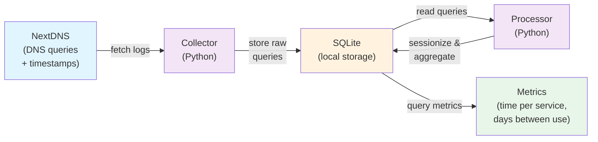
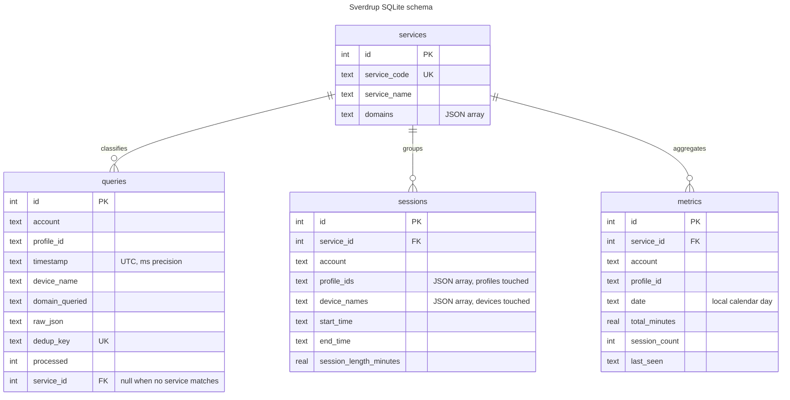
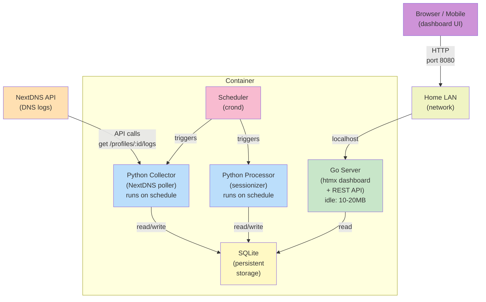
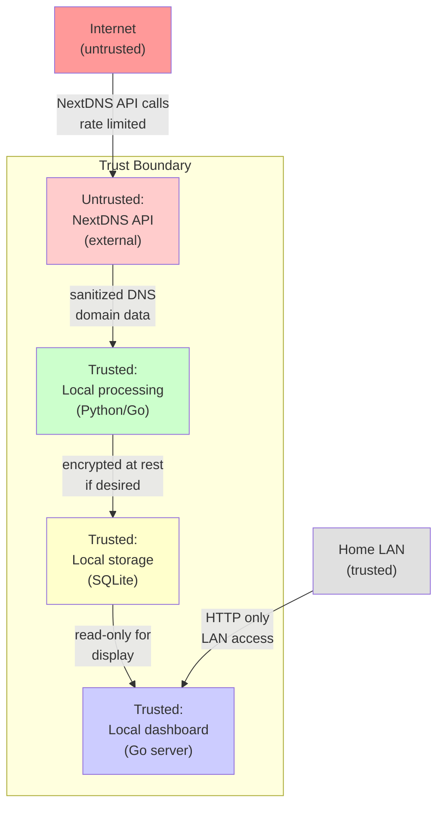

# Sverdrup Architecture

## Overview

Sverdrup is a containerized streaming-service usage measurement system. It collects DNS query logs from NextDNS, processes them into viewing sessions, stores them in SQLite, and serves analytics and insights via a lightweight web dashboard.

The system is designed for home deployment: minimal idle footprint (~10-20MB), mobile-friendly interface, and no external dependencies beyond NextDNS. It can eventually evolve to act as a local DNS server or support additional data sources.

## Design Principles

- **Low idle footprint:** Long-running server is Go (minimal memory); batch jobs are Python (cost only when running)
- **Self-contained:** Single container with all components; SQLite holds all data
- **Privacy-first:** Data never leaves your network; all processing is local
- **LAN-only by default:** Dashboard accessible only on local network, with option for reverse-proxy deployment
- **Incremental:** Backfills NextDNS history on first run, then polls incrementally; local storage becomes the long-term archive

## System Architecture

The system has three main layers: collection, processing, and presentation.

### Data Layer

The data flow from NextDNS through to metrics:



**Data model:**
- **Queries table:** account, profile_id, timestamp, device_name, domain_queried, raw_json (the full NextDNS event), plus dedup_key, processed and service_id for the pipeline
- **Sessions table:** service_id, account, profile_ids, device_names, start_time, end_time, session_length_minutes (sessionized queries grouped by service within an account, and gaps; profile_ids and device_names list every profile and device the session touched)
- **Services table:** service_code (netflix, spotify, etc.), service_name, domains (JSON list of DNS domains to match)
- **Metrics table:** service_id, account, profile_id, date, total_minutes, session_count, last_seen (one row per service, profile and local day, so the per-profile breakdown stays queryable)
- **Metadata table:** key/value pairs such as per-profile `profile:<id>:latest_timestamp` and `backfill_completed_at`

The schema lives in `sverdrup/db.py`, is created idempotently (`CREATE ... IF NOT EXISTS`) by whichever job runs first, and is shared by the collector and processor.



**Figure.** Every stored DNS query keeps its account and profile, and sessions and daily metrics are derived from the queries that match a service.

Lifetime and cross-profile figures are not stored; they are aggregations of `metrics` (for example `SUM(total_minutes)`, `SUM(session_count)` and `MAX(last_seen)` grouped by service and date).

### Infrastructure Layer

Deployment and runtime architecture:



**Key properties:**
- **Single container image:** Go binary, Python scripts, SQLite database
- **Scheduler:** crond manages collector and processor execution on a fixed interval (e.g., every 15 minutes for collector, hourly for processor)
- **Go server:** Always-on, stateless, reads from SQLite
- **Separation of concerns:** Collector handles API polling; processor handles data transformation; server handles query and presentation
- **Entrypoint script:** Container startup runs both crond (background) and Go server (foreground) so scheduled jobs execute within the container

### Security and Trust Layer



**Security properties:**
- **External input validation:** NextDNS API responses are validated before storage
- **No credentials in container:** NextDNS API keys (one per account) and the API URL are environment variables, passed at runtime from an env file; the collector never logs a key and redacts one if anything tries
- **Local-only by default:** Dashboard listens on localhost; accessible only on home LAN
- **Reverse-proxy ready:** Can be placed behind a reverse proxy for broader access (authentication is the proxy's responsibility)
- **No external data export:** All data remains on local storage; no phoning home

## Components

### 1. Collector (Python)

**Responsibility:** Fetch DNS logs from NextDNS API, backfill history on first run, poll incrementally.

**Runtime:** Scheduled job (Python script invoked every 15 minutes by crond)

**Inputs:**
- NextDNS API endpoint (env var: `NEXTDNS_API_URL`)
- NextDNS accounts (env var: `SVERDRUP_ACCOUNTS`, comma-separated short names such as `home,family`)
- For each account `NAME` (uppercased in the variable name): its API key (`NEXTDNS_<NAME>_API_KEY`) and the profile IDs to collect (`NEXTDNS_<NAME>_PROFILES`, comma-separated)

An API key belongs to a NextDNS account, and an account can own profiles you do not want; only the listed profiles are collected. Startup validation is strict and reports every problem at once, naming the variable: a missing key or profile list, an empty or duplicate profile ID (also across accounts), a bad account name, and the retired single-account variables `NEXTDNS_API_KEY`/`NEXTDNS_PROFILE_ID`. Messages never include a key.

**Outputs:**
- SQLite `queries` table: columns `id, account, profile_id, timestamp, device_name, domain_queried, raw_json, dedup_key` (the processor owns `processed` and `service_id`)

**Algorithm (per listed profile):**
1. If the profile has no stored rows: backfill all available logs (up to the retention window)
2. Otherwise: poll from the profile's last stored timestamp, minus a 10-minute overlap so late-arriving entries are not missed
3. Request pages oldest-first (`sort=asc`, `limit=1000`), following the pagination cursor
4. Insert each page with `INSERT OR IGNORE` on a unique `dedup_key` and commit it, then update the profile's earliest/latest timestamps in metadata
5. After a full backfill, record `backfill_completed_at`; exit (memory released)

**Error handling:**
- API rate limits: exponential backoff on HTTP 429 and 5xx (2s, 4s, 8s, ... capped at 300s, `Retry-After` honored), up to 6 retries
- Network errors and other HTTP errors: log, stop that profile, continue with the others; the run exits non-zero and the next scheduled run resumes
- Invalid data: lowercase and validate domains and timestamps, skip malformed entries, log a count
- Overlapping runs: a lock file next to the database makes a second run exit immediately

### 2. Processor (Python)

**Responsibility:** Sessionize DNS queries into viewing sessions; compute and cache metrics.

**Runtime:** Scheduled job (Python script invoked hourly by crond)

**Inputs:**
- SQLite `queries` table

**Outputs:**
- SQLite `sessions` table: columns `id, service_id, account, profile_ids, device_names, start_time, end_time, session_length_minutes`
- SQLite `metrics` table: columns `id, service_id, account, profile_id, date, total_minutes, session_count, last_seen`

**Configuration:** `SESSION_GAP_MINUTES` (default 15) and `TZ` (IANA zone that defines calendar days; default UTC).

**Algorithm:**
1. Read unprocessed queries from `queries` table
2. For each query, match domain to a streaming service using a domain-to-service mapping; store the match and mark the query processed. If the services table has changed since the last run, reclassify every query
3. Group consecutive matched queries (same service, same account, any profile, any device) into sessions, using the gap threshold: a gap longer than the threshold starts a new session; a gap exactly equal to it does not. Profile and device never split a session: NextDNS is usually set up at the router, so the logged device is unreliable, and profiles are many-to-many with clients (a client can move onto a VPN profile mid-viewing). Each session records every profile and device it touched
4. Calculate session length in minutes (last query minus first query)
5. Aggregate by service, profile and local day: sum total_minutes, count sessions, take the latest matched query as last_seen. Within a session, the time between two queries belongs to the profile of the earlier query, and the session counts once, under the profile it started in
6. Replace the `sessions` and `metrics` tables with the result in one transaction; exit

Steps 3-6 recompute from every matched query on each run rather than appending, so re-running never double-counts and late-arriving queries join the right session.

**Domain mappings** (the seed list in `sverdrup/services.py`; a domain also matches all of its subdomains, on whole labels, and the most specific domain wins):
- Netflix: `netflix.com`, `netflix.net`, `nflxvideo.net`, `nflximg.net`, `nflxext.com`, `nflxso.net`
- Spotify: `spotify.com`, `scdn.co`, `pscdn.co` (covers `audio-sp-*.pscdn.co`), `spotifycdn.com`, `spotifycdn.net`
- Disney+: `disneyplus.com`, `disney-plus.net`, `bamgrid.com`, `dssott.com`
- YouTube: `youtube.com`, `youtu.be`, `googlevideo.com`, `ytimg.com`
- Apple TV+: `tv.apple.com` only, so `ocsp.apple.com` certificate checks are not counted
- HBO Max: `hbomax.com`, `max.com`
- Paramount+: `paramountplus.com`, `cbsaavideo.com`
- Prime Video: `primevideo.com`, `aiv-cdn.net`, `aiv-delivery.net`, `amazon.com` (ambiguous; see limitations below)

`braintree-api.com` from the original sketch is left out: it is a payment processor that many unrelated sites use, so it would attribute their traffic to Disney+.

**Note on Amazon Prime Video:** Queries to `amazon.com` and related domains are inherently ambiguous (shopping, AWS, video, email, etc.). The design can tag them but will overcount actual video usage. Mitigation: use device-name or time-of-day heuristics, or accept the limitation in the initial version.

### 3. Dashboard Server (Go + htmx)

**Responsibility:** Serve a mobile-friendly web dashboard and REST API for metrics.

**Runtime:** Always-on container process; listens on port 8080 (configurable)

**Inputs:**
- SQLite `metrics` and `sessions` tables (read-only)

**Outputs:**
- HTTP/HTML responses (dashboard UI)
- JSON API endpoints for metric queries

**Key features:**
- **Home page:** Summary of services and time spent this week/month
- **Service detail page:** Time per day (sparkline + table), median days between use, cost per hour (if subscription cost entered)
- **Session history:** Recent viewing sessions with times and durations
- **Mobile responsive:** Works on phone browser without zoom
- **API endpoints** (JSON):
  - `GET /api/services` — list all services with summary stats
  - `GET /api/services/:id/metrics?start=DATE&end=DATE` — time series for a service
  - `GET /api/sessions?service=:id&limit=50` — recent sessions

**Framework:** Go's `net/http` + htmx for interactivity (no build step required)

**Session replay (future):** Can optionally store and replay "last session" times per device to infer what was watched

## Configuration and Deployment

### Environment Variables

The container expects these at runtime:

```
SVERDRUP_ACCOUNTS=home,family                # NextDNS accounts, as short names
NEXTDNS_HOME_API_KEY=<key>                   # API key of account "home"
NEXTDNS_HOME_PROFILES=<id1>,<id2>            # profiles to collect for "home"
NEXTDNS_FAMILY_API_KEY=<key>                 # one key and one profile list per account
NEXTDNS_FAMILY_PROFILES=<id3>
NEXTDNS_API_URL=https://api.nextdns.io      # NextDNS API endpoint
COLLECTOR_INTERVAL=15                        # minutes between collection runs
PROCESSOR_INTERVAL=60                        # minutes between processing runs (60 or more: whole hours)
SESSION_GAP_MINUTES=15                       # gap that ends a viewing session
TZ=UTC                                       # IANA time zone that defines a metrics day
DASHBOARD_PORT=8080                          # port for Go server
DB_PATH=/data/sverdrup.db                    # SQLite database path (inside container)
```

All of these go in one env file (`.env`, see `.env.example`), passed with `--env-file` or Compose `env_file`.

### LAN-Only (Default)

Container runs inside your home network. Dashboard is accessible at `http://localhost:8080` from any device on the LAN.

```
$ docker run --rm -d \
  --env-file .env \
  -v $(pwd)/data:/data \
  -p 8080:8080 \
  sverdrup:latest
```

### Reverse Proxy (Optional)

Place the container behind a reverse proxy (nginx, Caddy) with authentication (Basic Auth, OAuth2, or similar) for internet access.

```
# Example nginx config (simplified)
server {
    listen 443 ssl http2;
    server_name streaming.example.com;
    
    auth_basic "Sverdrup";
    auth_basic_user_file /etc/nginx/.htpasswd;
    
    location / {
        proxy_pass http://sverdrup:8080;
    }
}
```

### Future: Local DNS Server

Once mature, Sverdrup could act as a DNS forwarder/resolver on the home network, eliminating the NextDNS dependency and capturing all DNS queries locally. This would:
- Improve privacy (no external DNS API calls)
- Eliminate NextDNS retention limits
- Enable real-time data ingestion

Implementation is a separate project phase.

## Testing Strategy

Run the Python suite with one command from the repository root: `python3 -m pytest` (install `requirements-dev.txt` first). It runs offline: a mock NextDNS API is served on localhost, and no real credentials are used.

### Collector Tests (Python)
- Unit tests for domain matching and service classification
- Integration tests against a mock NextDNS API
- Backfill vs. incremental logic (time window validation)

### Processor Tests (Python)
- Unit tests for sessionization (gap detection, session boundaries)
- Aggregation and metric calculation accuracy
- Edge cases: midnight boundaries, device name changes

### Dashboard Tests (Go)
- Integration tests for API endpoints
- UI tests (Selenium or similar) for responsive layout and mobile rendering
- Load tests with large datasets (1000+ sessions)

### E2E Tests
- Full flow: synthetic NextDNS logs → collection → processing → dashboard display
- Data consistency: metrics table matches actual sessions

## Limitations and Future Work

1. **Amazon Prime Video ambiguity:** `amazon.com` queries cannot reliably distinguish shopping from video use. The initial version accepts the overcount: every `amazon.com` host, including Alexa and Fire device chatter, counts as Prime Video. Consider device-name filtering later.
2. **Accounts and profiles:** Logs are collected per NextDNS profile, from one or more accounts. Profiles are many-to-many with clients, so sessions span profiles and metrics attribute minutes to each profile; accounts are kept apart.
3. **Concurrent sessions:** The design aggregates by service and day but does not track simultaneous viewing (e.g., two people watching different services). This is acceptable for the first version.
   - **Concurrent viewers of one service merge:** sessions are formed per account and service, so two people watching the same service at once, on any devices or profiles, produce one session covering the union of their viewing. Usage is undercounted, never overcounted.
4. **Cost calculation:** If you enter subscription prices, cost-per-hour is a rough estimate (doesn't account for price changes, trial periods, or shared accounts).
5. **Data retention:** Depends on local storage. Recommend at least 2 years on any NAS or storage device running the container.
6. **Session length from DNS:** A session lasts from its first to its last matched query, so a lone query is a zero-minute session, and viewing after the last DNS lookup is not counted. DNS caching makes this an undercount.
7. **Device identity is not used:** The NextDNS logs API reports `device.id` (scoped to a profile), `device.name` and `device.model`, but with NextDNS set up at the router most queries carry the router or no device at all. The collector stores the device name (falling back to its ID, then `unknown` for a missing or `__UNIDENTIFIED__` device) for reference only; sessions ignore it.

## Implementation Decisions

Choices made where the design above was silent, recorded so they can be revisited:

- **Python standard library only.** The collector uses `urllib`, so the container needs no `pip install`; `pytest` and `black` are development dependencies (`requirements-dev.txt`).
- **Timestamps** are stored as fixed-width UTC strings (`YYYY-MM-DDTHH:MM:SS.mmmZ`) so text order is time order.
- **Backfill is per profile:** a profile with no stored rows is backfilled, so adding a profile later backfills just that profile. Pages are fetched oldest-first and committed one at a time, so an interrupted backfill resumes from the last stored row.
- **Deduplication:** `dedup_key` is a SHA-256 of the profile, normalized timestamp, domain, device ID and name, client IP, protocol and query type. Two genuinely identical queries in the same millisecond collapse into one row, which does not change any session.
- **Midnight:** a session's minutes are split at local midnight (per `TZ`, DST-aware); the session counts once, on the day it starts. Summing `total_minutes` and `session_count` over all metric rows therefore equals the sessions table's totals.
- **Metrics grain:** one row per service, profile and local day. Lifetime and cross-profile figures are aggregations, not stored rows.
- **Sessions per account and service:** a session ignores profile and device. Its time between consecutive queries is attributed to the earlier query's profile, and it counts once, under the profile it started in; the sessions table records the profiles and devices it touched as JSON arrays. When two clients in different profiles watch at once, the per-profile split follows whichever profile queried last, while the total stays the session's wall-clock length.
- **NextDNS query defaults:** the collector does not pass `raw`, so it stores NextDNS's default view (navigational queries, deduplicated by NextDNS).
- **Scheduling:** an interval under 60 minutes runs every N minutes; 60 or more runs on the hour every N/60 hours.
